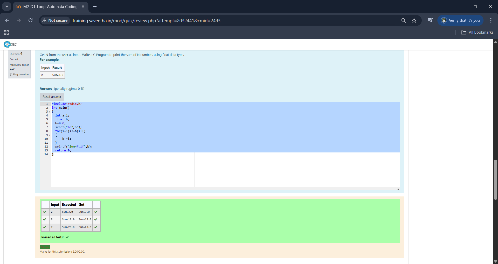
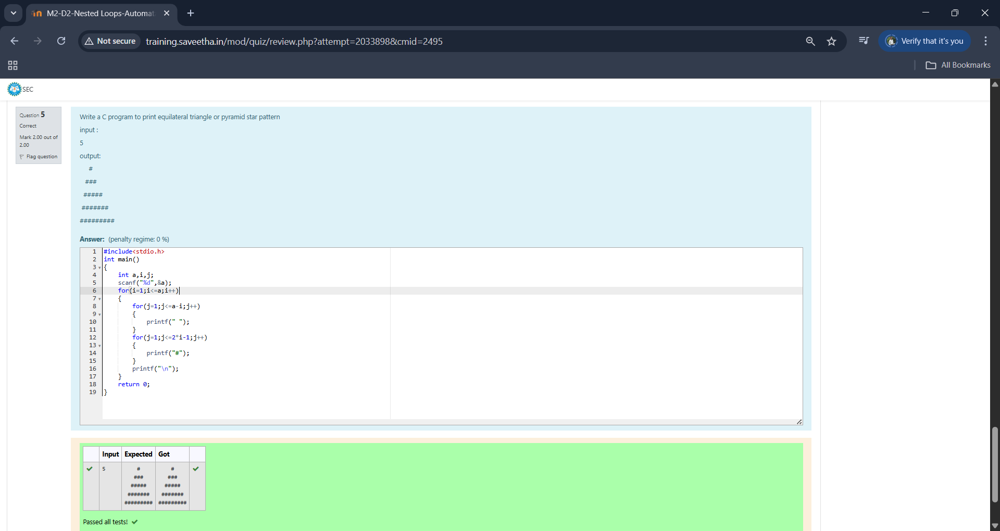
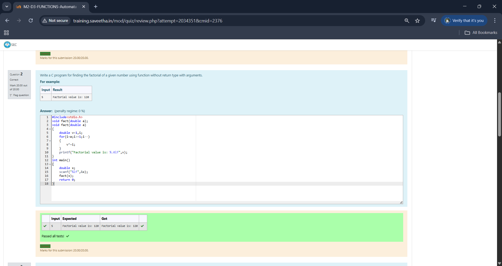
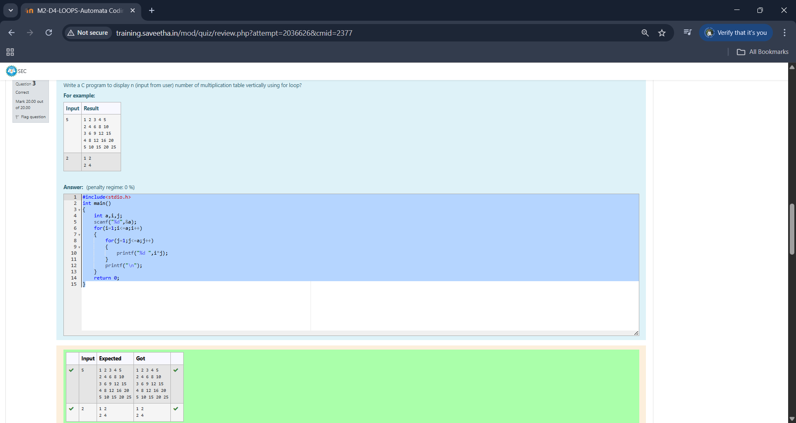
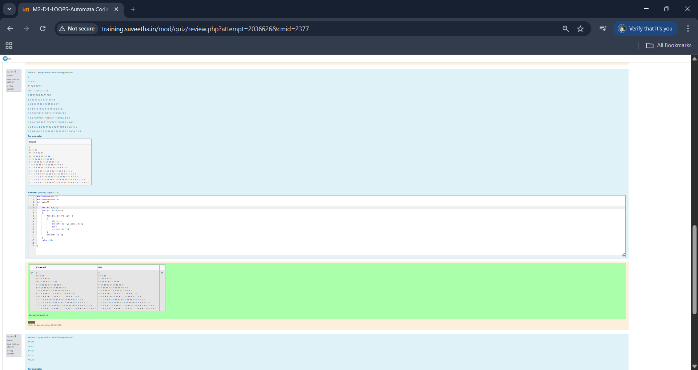

# EX-06 - Looping
## AIM:
Get N from the user as input. Write a C Program to print the sum of N numbers using float data type.

## ALGORITHM:
1.	Declare one integer variable to store the values of a,one float variable b intialized to 0.
2.	Use for loop to iterate a times and add the value of i to b inside the loop.
3.  Print b as sum after the loop.
4.  End of function.

## PROGRAM:
```
#include<stdio.h>
int main()
{
  int a,i;
  float b;
  b=0.0;
  scanf("%d",&a);
  for(i=1;i<=a;i++)
  {
      b+=i;
  }
  printf("Sum=%.1f",b);
  return 0;
}
```

## OUTPUT:




## RESULT:
Thus the program to to print the sum of N numbers using float data type been executed successfully
 
 


# EX-07-Nested-loop

## AIM:

Write a C program to print equilateral triangle or pyramid star pattern.

## ALGORITHM:

1.	Declare a variable to store the number of rows in the triangle.
2.	Use the printf function to prompt the user to enter the number of rows.
3.	Use a loop (for or while) to iterate through each row.
    a.  Inside the loop,use nested loop to print the desired number of spaces.
    b.	use another loop to print the desired number of hashtag for each row.
4.	Continue the loop until you have printed the entire triangular pattern.
5.  End of program.

## PROGRAM:
```
#include<stdio.h>
int main()
{
    int a,i,j;
    scanf("%d",&a);
    for(i=1;i<=a;i++)
    {
        for(j=1;j<=a-i;j++)
        {
            printf(" ");
        }
        for(j=1;j<=2*i-1;j++)
        {
            printf("#");
        }
        printf("\n");
    }
    return 0;
}
```


## OUTPUT:



## RESULT:

Thus the program to print equilateral triangle or pyramid star pattern has been executed successfully
 
 


# EX-08-Functions

## AIM:

Write a C program for finding the factorial of a given number using function without return type with arguments.

## ALGORITHM:

1.	Declare a function with double formatted argument 'a'.
2.	declare a variable inside the function with initialized value 1 'v'.
3.  Using for loop iterate a times and multiply 'i' with v.
4.  Print v as the factorial outside the loop.
5.  In the main function use scanf f to get the value and call the factorial function.
6.  End of program.

## PROGRAM:
```
#include<stdio.h>
void fact(double a);
void fact(double a)
{
    double v=1,i;
    for(i=a;i>=1;i--)
    {
        v*=i;
    }
    printf("Factorial value is: %.0lf",v);
}
int main()
{
    double x;
    scanf("%lf",&x);
    fact(x);
    return 0;
}
```


## OUTPUT:




## RESULT:

Thus the program for finding the factorial of a given number using function without return type with arguments has been executed successfully
 
 


# EX-09-Use For Loop

## AIM:

Write a C program to display n (input from user) number of multiplication table vertically using for loop?

## ALGORITHM:

1.	Declare variable to store the input number till which the table must be printed 'a'.
2.  Use scanf to get input from user.
3.  Use for loop 'a' times to get the number of rows correct.The row number gives the tables main element.
4.  Use nested loop 'a' times which gives the other factors.
5.  Print i*j inside the second loop to print the table content.
6.  End of program.
## PROGRAM:
```
#include<stdio.h>
int main()
{
    int a,i,j;
    scanf("%d",&a);
    for(i=1;i<=a;i++)
    {
        for(j=1;j<=a;j++)
        {
            printf("%d ",i*j);
        }
        printf("\n");
    }
    return 0;
}
```

## OUTPUT:



## RESULT:

Thus the program to display n (input from user) number of multiplication table vertically using for loop has been executed successfully.


# EX – 10 - Pattern
## AIM:
Write a C program for the following pattern?
## ALGORITHM:
1.	include stdlib to use abs->to change negative to positive.
2.  Declare a int variable and initialize value to 13.
4.  Use for loop to iterate the number of rows.
5.  Use a nested loop to iterate the width of each row.
    a.  inside pass a if condition to print 0 if j==i.
    b.  Else print a-abs(i-j) to print the desired number    
6.	End of program.

## PROGRAM:
```
#include<stdio.h>
#include<stdlib.h>
int main()
{
    int a=13,i,j;
    for(i=1;i<=a;i++)
    {
        for(j=1;j<=2*i-1;j++)
        {
            if(j!=i)
            printf("%d ",a-abs(i-j));
            else
            printf("%d ",0);
        }
        printf("\n");
    }
    return 0;
}
```

## OUTPUT:


## RESULT:
Thus the program for the following patternhas been executed successfully.


